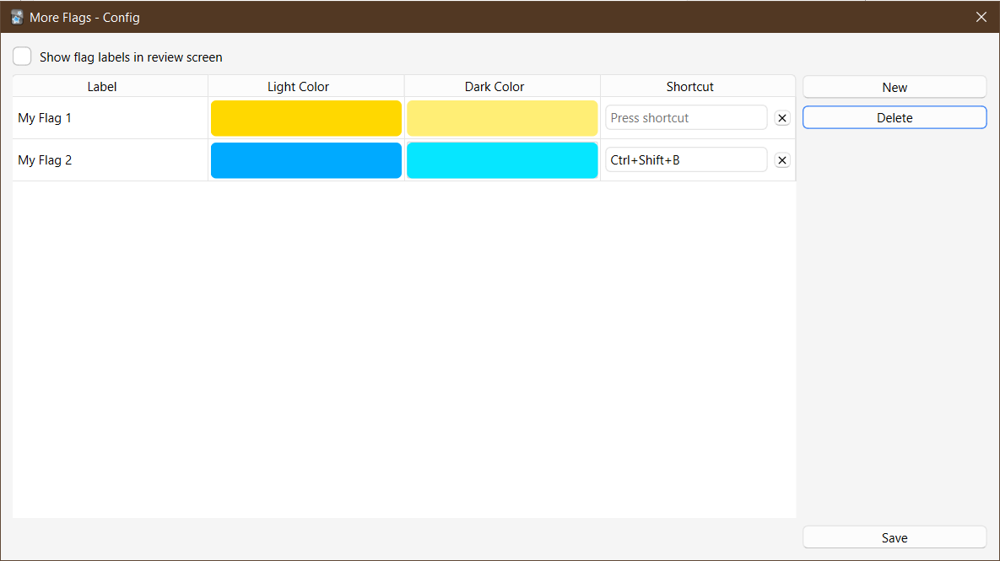

# More Flags

This Anki add-on adds the ability to add more card flags. You can add flags and customize their labels, colors and shortcuts from the config window under _Tools > Add-ons > Config_.

The add-on should work on Anki 2.1.46+.

The custom flags should behave like standard ones for the most part, but there are some issues to be aware of:

-   Searching for custom flags is only supported on 2.1.64+.
-   The "No Flag" sidebar item only understands custom flags on Anki 23.10+.
-   When you delete a custom flag from the config, it's not removed from the cards. So if you later add a new flag in place of the old one the cards will automatically reflect the new flag. This might change in the future.
-   Custom flags only work on the computer version.

## Download

You can download the add-on from AnkiWeb: [146757953](https://ankiweb.net/shared/info/146757953)

## Changelog

See [CHANGELOG.md](CHANGELOG.md) for a list of changes.

## Credit

Icons are from [Bootstrap Icons](https://getbootstrap.com/).

## Support & feature requests

Please post any questions, bug reports, or feature requests in the [support page](https://forums.ankiweb.net/c/add-ons/11) or the [issue tracker](https://github.com/abdnh/anki-addon-template/issues).

If you want priority support for your feature/help request, I'm available for hire.
Get in touch via [email](mailto:abdo@abdnh.net) or the UpWork link below.

## Support me

Consider supporting me if you like my work:

I'm also available for freelance add-on development:

